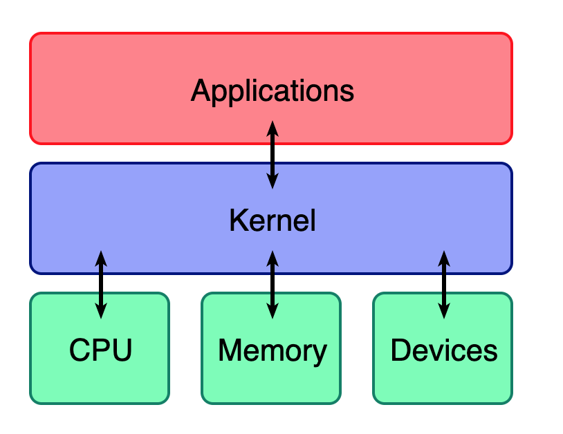
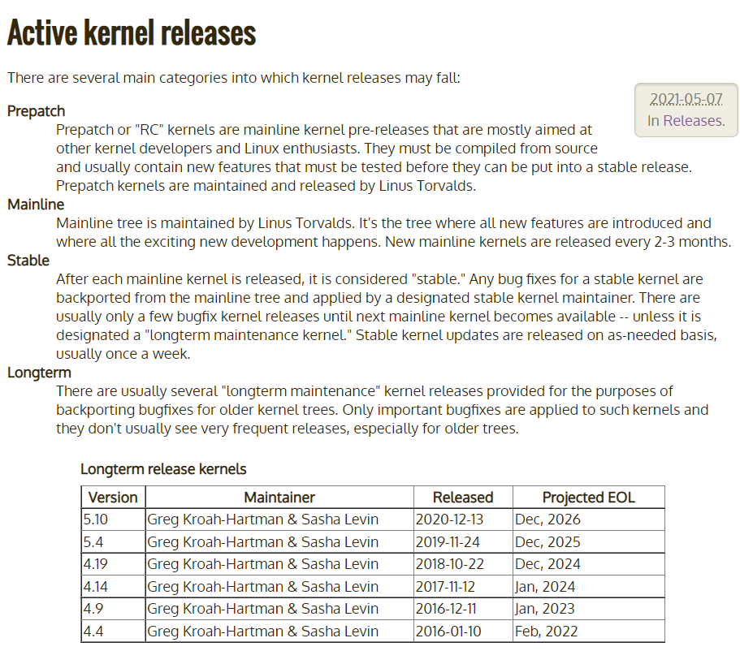
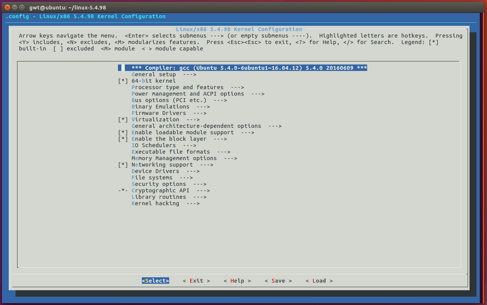
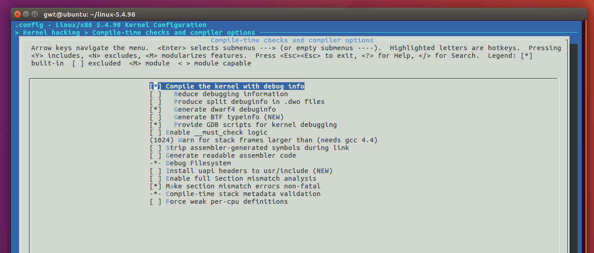

[toc]

kernel环境搭建

基本都是网上的内容



# 内核相关的知识点

## glibc PWN与内核PWN区别

-   用户态攻击: 执行 system("/bin/sh") 获得shell，用python
-   内核提权:
    1.  内核执行 **commit_creds(prepare_kernel_cred(0))** 使进程获得root权限
    2.  用户态进程执行system("/bin/sh") 获得root权限 shell
    3.  更多的是用C语言写exp

**1.一般背景：**内核pwn的背景一般都是Linux内核模块所出现的漏洞的利用。众所周知，Linux的内核被设置成可扩展的，我们可以自己开发内核模块，如各种驱动程序；其后缀常常是ko。由于这些内核模块运行时的权限是root权限，因此我们将有机会借此拿到root权限的shell。

**2.题目形式：**不同于用户态的pwn，kernel pwn不再是用python远程链接打payload拿shell，而是给你一个环境包，下载后qemu本地起系统，flag文件就在这个虚拟系统里面，权限是root，因此那flag的过程也是选手在自己的环境里完成，exploit往往也是C编写。

**3.流程与攻击面：**内核pwn的攻击面其实仍然是用户态的那些传统攻击面，各种堆栈幺蛾子等等。流程上就是C程序exp调用内核模块利用其漏洞提权，只是提权后要“着陆”回用户态拿shell。提权代码是`commit_creds(prepare_kernel_cred(0))`。详解请参考ctf-wiki。


# 内核下载与编译

从https://www.kernel.org/category/releases.html 可以看出内核有如下四种类别：



这里我们使用长期支持版的5.4版，清华源：https://mirrors.tuna.tsinghua.edu.cn/kernel/

```sh
gwt@ubuntu:~$ curl -O -L https://mirrors.tuna.tsinghua.edu.cn/kernel/v5.x/linux-5.4.98.tar.xz -k
  % Total    % Received % Xferd  Average Speed   Time    Time     Time  Current
                                 Dload  Upload   Total   Spent    Left  Speed
100  104M  100  104M    0     0  7462k      0  0:00:14  0:00:14 --:--:-- 7462k ar
gwt@ubuntu:~$ tar -xf linux-5.4.98.tar.xz
```

## 编译选项配置

在正式编译之前，我们可以配置内核的编译选项。

make menuconfig

有报错：

```sh
gwt@ubuntu:~/linux-5.4.98$ make menuconfig
  HOSTCC  scripts/basic/fixdep
*
* Unable to find the ncurses package.
* Install ncurses (ncurses-devel or libncurses-dev
* depending on your distribution).
*
scripts/kconfig/Makefile:208: recipe for target 'scripts/kconfig/mconf-cfg' failed
make[1]: *** [scripts/kconfig/mconf-cfg] Error 1
Makefile:590: recipe for target 'menuconfig' failed
make: *** [menuconfig] Error 2
```

执行`sudo apt-get install ncurses-dev`，还是报错：

```sh
gwt@ubuntu:~/linux-5.4.98$ make menuconfig
  UPD     scripts/kconfig/mconf-cfg
  HOSTCC  scripts/kconfig/mconf.o
  HOSTCC  scripts/kconfig/lxdialog/checklist.o
  HOSTCC  scripts/kconfig/lxdialog/inputbox.o
  HOSTCC  scripts/kconfig/lxdialog/menubox.o
  HOSTCC  scripts/kconfig/lxdialog/textbox.o
  HOSTCC  scripts/kconfig/lxdialog/util.o
  HOSTCC  scripts/kconfig/lxdialog/yesno.o
  HOSTCC  scripts/kconfig/confdata.o
  HOSTCC  scripts/kconfig/expr.o
  LEX     scripts/kconfig/lexer.lex.c
/bin/sh: 1: flex: not found
scripts/Makefile.host:9: recipe for target 'scripts/kconfig/lexer.lex.c' failed
make[1]: *** [scripts/kconfig/lexer.lex.c] Error 127
Makefile:590: recipe for target 'menuconfig' failed
make: *** [menuconfig] Error 2
```

继续安装flex：`sudo apt-get install flex`，之后编译，正常：



这里我们主要关注调试方面的选项，依次进入到 `Kernel hacking` -> `Compile-time checks and compiler options`，然后勾选如下选项`Compile the kernel with debug info`，以便于调试。




## 编译内核

编译内核镜像，可以根据机器的核数来选择具体使用多少核来编译内核。

使用：`make -j3 bzImage`,又报错：

```sh
gwt@ubuntu:~/linux-5.4.98$ make -j3 bzImage
  SYSTBL  arch/x86/include/generated/asm/syscalls_32.h
  WRAP    arch/x86/include/generated/uapi/asm/bpf_perf_event.h
  WRAP    arch/x86/include/generated/uapi/asm/errno.h
  WRAP    arch/x86/include/generated/uapi/asm/fcntl.h
  WRAP    arch/x86/include/generated/uapi/asm/ioctl.h
  WRAP    arch/x86/include/generated/uapi/asm/ioctls.h
  WRAP    arch/x86/include/generated/uapi/asm/ipcbuf.h
  WRAP    arch/x86/include/generated/uapi/asm/param.h
  WRAP    arch/x86/include/generated/uapi/asm/poll.h
  WRAP    arch/x86/include/generated/uapi/asm/resource.h
  WRAP    arch/x86/include/generated/uapi/asm/socket.h
  WRAP    arch/x86/include/generated/uapi/asm/sockios.h
  WRAP    arch/x86/include/generated/uapi/asm/termbits.h
  WRAP    arch/x86/include/generated/uapi/asm/termios.h
  WRAP    arch/x86/include/generated/uapi/asm/types.h
  UPD     include/generated/uapi/linux/version.h
  HOSTCC  arch/x86/tools/relocs_32.o
  UPD     include/config/kernel.release
  SYSHDR  arch/x86/include/generated/asm/unistd_32_ia32.h
  SYSHDR  arch/x86/include/generated/asm/unistd_64_x32.h
  SYSTBL  arch/x86/include/generated/asm/syscalls_64.h
  HOSTCC  arch/x86/tools/relocs_64.o
  HOSTCC  arch/x86/tools/relocs_common.o
  HOSTLD  arch/x86/tools/relocs
  WRAP    arch/x86/include/generated/asm/dma-contiguous.h
  WRAP    arch/x86/include/generated/asm/early_ioremap.h
  WRAP    arch/x86/include/generated/asm/export.h
  WRAP    arch/x86/include/generated/asm/mcs_spinlock.h
  WRAP    arch/x86/include/generated/asm/mm-arch-hooks.h
  WRAP    arch/x86/include/generated/asm/mmiowb.h
  UPD     include/generated/utsrelease.h
warning: Cannot use CONFIG_STACK_VALIDATION=y, please install libelf-dev, libelf-devel or elfutils-libelf-devel
  HOSTCC  scripts/selinux/genheaders/genheaders
  HOSTCC  scripts/selinux/mdp/mdp
  HYPERCALLS arch/x86/include/generated/asm/xen-hypercalls.h
  SYSHDR  arch/x86/include/generated/uapi/asm/unistd_32.h
  SYSHDR  arch/x86/include/generated/uapi/asm/unistd_64.h
  SYSHDR  arch/x86/include/generated/uapi/asm/unistd_x32.h
  HOSTCC  scripts/bin2c
  HOSTCC  scripts/kallsyms
  HOSTCC  scripts/conmakehash
  HOSTCC  scripts/recordmcount
  HOSTCC  scripts/sortextable
  HOSTCC  scripts/asn1_compiler
  HOSTCC  scripts/sign-file
scripts/sign-file.c:25:30: fatal error: openssl/opensslv.h: No such file or directory
compilation terminated.
scripts/Makefile.host:107: recipe for target 'scripts/sign-file' failed
make[1]: *** [scripts/sign-file] Error 1
make[1]: *** Waiting for unfinished jobs....
Makefile:1120: recipe for target 'scripts' failed
make: *** [scripts] Error 2
```

要安装OpenSSL包，`sudo apt-get install libssl-dev`，之后就再编译OK了，时间可能有点久。

```text
Setup is 17756 bytes (padded to 17920 bytes).
System is 8628 kB
CRC ce49a83
Kernel: arch/x86/boot/bzImage is ready  (#1)
```

出现上面的内容就算完成了，主要关注两个文件：

-   bzImage：`arch/x86/boot/bzImage`
-   vmlinux：源码所在的根目录下。

这里给出常见内核文件的介绍。

-   **bzImage**：目前主流的 kernel 镜像格式，即 big zImage（即 bz 不是指 bzip2），适用于较大的（大于 512 KB） Kernel。这个镜像会被加载到内存的高地址，高于 1MB。bzImage 是用 gzip 压缩的，文件的开头部分有 gzip 解压缩的代码，所以我们不能用 gunzip 来解压缩。
-   **zImage**：比较老的 kernel 镜像格式，适用于较小的（不大于 512KB） Kernel。启动时，这个镜像会被加载到内存的低地址，即内存的前 640 KB。zImage 也不能用 gunzip 来解压缩。
-   **vmlinuz**：vmlinuz 不仅包含了压缩后的 vmlinux，还包含了 gzip 解压缩的代码。实际上就是 zImage 或者 bzImage 文件。该文件是 bootable 的。 bootable 是指它能够把内核加载到内存中。对于 Linux 系统而言，该文件位于 /boot 目录下。该目录包含了启动系统时所需要的文件。
-   **vmlinux**：静态链接的 Linux kernel，以可执行文件的形式存在，尚未经过压缩。该文件往往是在生成 vmlinuz 的过程中产生的。该文件适合于调试。但是该文件不是 bootable 的。
-   **vmlinux.bin**：也是静态链接的 Linux kernel，只是以一个可启动的 (bootable) 二进制文件存在。所有的符号信息和重定位信息都被删除了。生成命令为：`objcopy -O binary vmlinux vmlinux.bin`。
-   **uImage**：uImage 是 U-boot 专用的镜像文件，它是在 zImage 之前加上了一个长度为 0x40 的 tag 而构成的。这个 tag 说明了这个镜像文件的类型、加载位置、生成时间、大小等信息。

# qemu安装与调试

可以直接包管理安装或者源码编译，这里为了方便就直接包了：

```sh
apt-get install qemu
```

## 文件系统

这里我们使用 busybox 来构建一个简单的文件系统。

```sh
wget https://busybox.net/downloads/busybox-1.33.0.tar.bz2
tar -jxvf busybox-1.33.0.tar.bz2
```

之后进入配置页面`make menuconfig`

选择Settings —-> Build static binary file (no shared lib)

然后就是编译了

```shell
make install
```

编译完成后会生成一个`_install`目录，接下来我们将会用它来构建我们的磁盘镜像


在\_install下创建

```sh
mkdir -p  proc sys dev etc/init.d
```

新建个init脚本并写入：

```sh
#!/bin/sh
echo "INIT SCRIPT"
mkdir /tmp
mount -t proc none /proc
mount -t sysfs none /sys
mount -t devtmpfs none /dev
mount -t debugfs none /sys/kernel/debug
mount -t tmpfs none /tmp
echo -e "Boot took $(cut -d' ' -f1 /proc/uptime) seconds"
setsid /bin/cttyhack setuidgid 1000 /bin/sh
```

然后chmod +x init

之后在\_install下打包整个文件系统

```sh
gwt@ubuntu:~/busybox-1.32.1/_install$ find . | cpio -o --format=newc > ../rootfs.img
5523 blocks
```

还可以使用如下的命令重新解包文件系统

```sh
cpio -idmv < rootfs.img
```

# 启动内核

上面的bzImage和rootfs.img放到一个目录，启动脚本：

```sh
#!/bin/sh
qemu-system-x86_64 \
    -m 64M \
    -nographic \
    -kernel ./bzImage \
    -initrd  ./rootfs.img \
    -append "root=/dev/ram rw console=ttyS0 oops=panic panic=1 kalsr" \
    -smp cores=2,threads=1 \
    -cpu kvm64
```

启动之后的效果：

```sh
INIT SCRIPT
Boot took 3.23 seconds
/ $ ls
bin      etc      linuxrc  root     sys      usr
dev      init     proc     sbin     tmp
/ $ 
```


在没有设置 monitor 时，我们可以使用`ctrl-a+c` 来进入 monitor，可以看到 monitor 提供了很多命令。

```sh
/ $ QEMU 2.5.0 monitor - type 'help' for more information
(qemu) help
acl_add aclname match allow|deny [index] -- add a match rule to the access control list
acl_policy aclname allow|deny -- set default access control list policy
acl_remove aclname match -- remove a match rule from the access control list
acl_reset aclname -- reset the access control list
acl_show aclname -- list rules in the access control list
balloon target -- request VM to change its memory allocation (in MB)
block_job_cancel [-f] device -- stop an active background block operation (use -f
			 if the operation is currently paused)
block_job_complete device -- stop an active background block operation
block_job_pause device -- pause an active background block operation
block_job_resume device -- resume a paused background block operation
block_job_set_speed device speed -- set maximum speed for a background block operation
block_passwd block_passwd device password -- set the password of encrypted block devices
block_resize device size -- resize a block image
block_set_io_throttle device bps bps_rd bps_wr iops iops_rd iops_wr -- change I/O throttle limits for a block drive
block_stream device [speed [base]] -- copy data from a backing file into a block device
boot_set bootdevice -- define new values for the boot device list
change device filename [format [read-only-mode]] -- change a removable medium, optional format
chardev-add args -- add chardev
chardev-remove id -- remove chardev
.......
```


在用 qemu 启动内核时，常用的选项如下

-   -m， 指定 RAM 大小，默认 384M
-   -kernel，指定内核镜像文件 bzImage 路径
-   -initrd，设置内核启动的内存文件系统
-   `-smp [cpus=]n[,cores=cores][,threads=threads][,dies=dies][,sockets=sockets][,maxcpus=maxcpus]`，指定使用到的核数。
-   -cpu，指定指定要模拟的处理器架构，可以同时开启一些保护，如
    -   +smap，开启 smap 保护
    -   +smep，开启 smep 保护
-   -nographic，表示不需要图形界面
-   -monitor，对 qemu 提供的控制台进行重定向，如果没有设置的话，可以直接进入控制台。
-   -append，附加选项
    -   `nokaslr` 关闭随机偏移
    -   console=ttyS0，和 `nographic` 一起使用，启动的界面就变成了当前终端。

# 编译内核驱动

```c
#include <linux/init.h>
#include <linux/module.h>
#include <linux/kernel.h>
MODULE_LICENSE("Dual BSD/GPL");
static int ko_test_init(void) 
{
    printk("This is a test ko!\n");
    return 0;
}
static void ko_test_exit(void) 
{
    printk("Bye Bye~\n");
}
module_init(ko_test_init);
module_exit(ko_test_exit);
```

Makefile

```Makefile
ifneq ($(KERNELRELEASE),)
obj-m := hello.o
else
PWD := $(shell pwd)
KDIR:= /lib/modules/4.15.0-142-generic/build
# KDIR = /home/gwt/linux-5.4.98
all:
	make -C $(KDIR) M=$(PWD)
clean:	
	rm -rf *.o *.ko *.mod.c *.symvers *.c~ *~
endif
```


```sh
gwt@ubuntu:~/linux-5.4.98/drivers/hello$ dmesg
[    0.000000] Linux version 4.15.0-142-generic (buildd@lgw01-amd64-039) (gcc version 5.4.0 20160609 (Ubuntu 5.4.0-6ubuntu1~16.04.12)) #146~16.04.1-Ubuntu SMP Tue Apr 13 09:27:15 UTC 2021 (Ubuntu 4.15.0-142.146~16.04.1-generic 4.15.18)
[    0.000000] Command line: BOOT_IMAGE=/boot/vmlinuz-4.15.0-142-generic root=UUID=f2ae1957-0f29-4af2-8408-4347372d9f20 ro find_preseed=/preseed.cfg auto noprompt priority=critical locale=en_US quiet
[    0.000000] KERNEL supported cpus:
[    0.000000]   Intel GenuineIntel
[    0.000000]   AMD AuthenticAMD
[    0.000000]   Centaur CentaurHauls
[    0.000000] x86/fpu: Supporting XSAVE feature 0x001: 'x87 floating point registers'
[    0.000000] x86/fpu: Supporting XSAVE feature 0x002: 'SSE registers'
[    0.000000] x86/fpu: Supporting XSAVE feature 0x004: 'AVX registers'
[    0.000000] x86/fpu: xstate_offset[2]:  576, xstate_sizes[2]:  256
[    0.000000] x86/fpu: Enabled xstate features 0x7, context size is 832 bytes, using 'compacted' format.
[    0.000000] e820: BIOS-provided physical RAM map:
[    0.000000] BIOS-e820: [mem 0x0000000000000000-0x000000000009e7ff] usable
[    0.000000] BIOS-e820: [mem 0x000000000009e800-0x000000000009ffff] reserved
[    0.000000] BIOS-e820: [mem 0x00000000000dc000-0x00000000000fffff] reserved
[    0.000000] BIOS-e820: [mem 0x0000000000100000-0x000000007fedffff] usable
[    0.000000] BIOS-e820: [mem 0x000000007fee0000-0x000000007fefefff] ACPI data
[    0.000000] BIOS-e820: [mem 0x000000007feff000-0x000000007fefffff] ACPI NVS
[    0.000000] BIOS-e820: [mem 0x000000007ff00000-0x000000007fffffff] usable
[    0.000000] BIOS-e820: [mem 0x00000000f0000000-0x00000000f7ffffff] reserved
[    0.000000] BIOS-e820: [mem 0x00000000fec00000-0x00000000fec0ffff] reserved
[    0.000000] BIOS-e820: [mem 0x00000000fee00000-0x00000000fee00fff] reserved
[    0.000000] BIOS-e820: [mem 0x00000000fffe0000-0x00000000ffffffff] reserved
[    0.000000] NX (Execute Disable) protection: active
[    0.000000] SMBIOS 2.7 present.
[    0.000000] DMI: VMware, Inc. VMware Virtual Platform/440BX Desktop Reference Platform, BIOS 6.00 07/22/2020
[    0.000000] Hypervisor detected: VMware
[    0.000000] vmware: TSC freq read from hypervisor : 2370.552 MHz
[    0.000000] vmware: Host bus clock speed read from hypervisor : 66000000 Hz
[    0.000000] vmware: using sched offset of 3715800521 ns
[    0.000000] e820: update [mem 0x00000000-0x00000fff] usable ==> reserved
[    0.000000] e820: remove [mem 0x000a0000-0x000fffff] usable
[    0.000000] e820: last_pfn = 0x80000 max_arch_pfn = 0x400000000
[    0.000000] MTRR default type: uncachable
..........
```

dmesg -C清一下，然后：

```sh
insmod hello.ko
```

之后dmesg查看（或者lsmod）确实装上了驱动。

# 加载驱动

当然，我们还可以加载之前编译的驱动。将生成的 ko 文件拷贝到 busybox 的 `_install` 目录下，然后对启动脚本进行修改，添加 `insmod /hello.ko` ，具体如下

```sh
#!/bin/sh
echo "INIT SCRIPT"
mkdir /tmp
mount -t proc none /proc
mount -t sysfs none /sys
mount -t devtmpfs none /dev
mount -t debugfs none /sys/kernel/debug
mount -t tmpfs none /tmp
insmod /hello.ko
echo -e "Boot took $(cut -d' ' -f1 /proc/uptime) seconds"
setsid /bin/cttyhack setuidgid 1000 /bin/sh
poweroff -f
```

打包文件系统，`find . | cpio -o --format=newc > ../rootfs.img`，放到和bzImage，init和上面一样，qemu 启动内核后，我们可以使用 dmesg 查看输出，可以看到确实加载了对应的 ko。

# 调试分析

这里我们简单介绍一下如何调试内核。

## 调试建议

为了方便调试，我们可以使用 root 用户启动 shell，即修改 init 脚本中对应的代码

```sh
- setsid /bin/cttyhack setuidgid 1000 /bin/sh
+ setsid /bin/cttyhack setuidgid 0 /bin/sh
```

此外，我们还可以在启动时，指定内核关闭随机化

```sh
#!/bin/sh
qemu-system-x86_64 \
    -m 64M \
    -nographic \
    -kernel ./bzImage \
    -initrd  ./rootfs.img \
    -append "root=/dev/ram rw console=ttyS0 oops=panic panic=1 nokalsr" \
    -smp cores=2,threads=1 \
    -cpu kvm64
```
