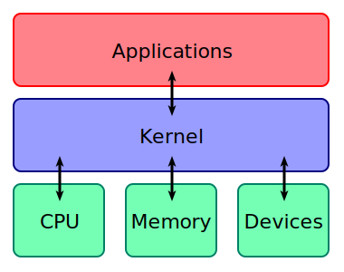
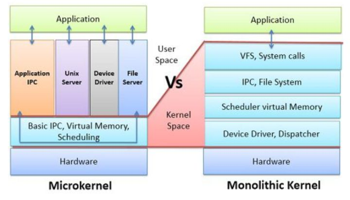
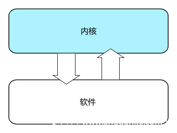
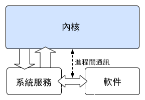
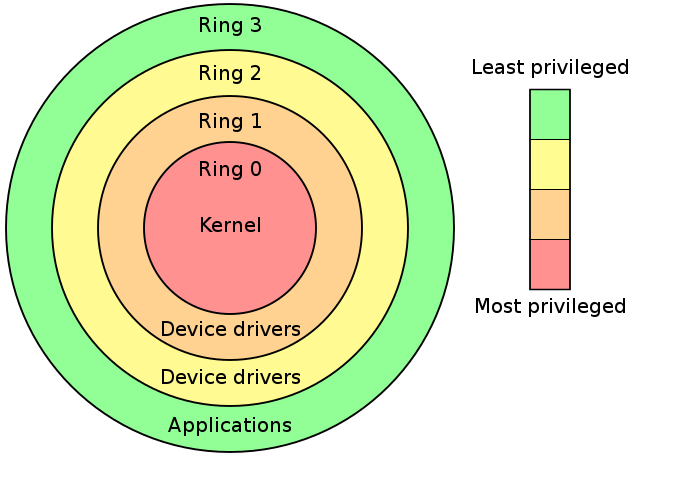
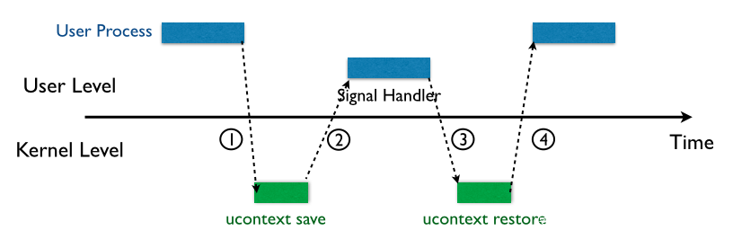

[toc]


首先是一张经典的图：



# 内核

**操作系统**（Operation System）本质上也是一种软件。

kernel的主要功能可以归为以下三点：

-   **控制并与硬件进行交互**
-   **提供应用程式运行环境**
-   **调度系统资源**

kernel的crash通常会引起重启。

## 内核架构（宏内核&微内核）




### 宏内核

通俗地说，宏内核几乎将一切都集成到了内核当中，并向上层应用程式提供抽象API（通常是以系统调用的形式）

Unix与类Unix便是宏内核



### 微内核

大部分的系统服务（如文件管理等）都被剥离于内核之外，内核仅仅提供最为基本的一些功能：底层的寻址空间管理、线程管理、进程间通信等。




# 分级保护域

分级保护域（**hierarchical protection domains**）又被称作保护环，简称 Rings ，是一种将计算机不同的资源划分至不同权限的模型。

Ring0 拥有最高特权，并且可以和最多的硬件直接交互（比如CPU，内存）

内层ring可以任意调用外层ring的资源

Intel的CPU将权限分为四个等级：**Ring0**、Ring1、Ring2、**Ring3**，权限等级依次降低



**大部分现代操作系统只用到了ring0 和 ring3，其中 kernel 运行在 ring0，用户态程序运行在 ring3**

操作系统本身便是一个运行在内核态的程序，当计算机通电之后处于实模式下，从磁盘上载入第一个扇区（MBR）执行，之后载入第二引导程序（Linux通常用 GNU Grub），由第二引导程序来将操作内核载入到内存当中并跳转到内核入口点，将控制权移交内核

## 进程运行态切换

应用程式运行时总会经历无数次的用户态与内核态之间的转换，这是因为用户进程往往需要使用内核所提供的各种功能（如IO等），此时就需要陷入（trap）内核，待完成之后再“着陆”回用户态

## 信号机制

signal机制



-   Pre. 内核代替进程接受信号，将信号放入对应进程的信号队列中，同时将对应进程**挂起**，让进程陷入内核态
-   ① 进程陷入内核态后，在返回用户态前会检测信号队列，若存在新信号则开始进入信号处理流程：内核会**将用户态进程的寄存器逐一压入【用户态进程的栈上】**，形成一个`sigcontext`结构体，接下来压入 SIGNALINFO 以及**指向系统调用 sigreturn 的代码**，用以在后续返回时恢复用户态进程上下文；压入栈上的这一大块内容称之为一个 `SigreturnFrame`，同时也是一个`ucontext_t`结构体；接下来就是内核内部的工作了
-   ② 控制权回到用户态进程，**用户态进程**跳转到相应的 signal handler 函数以处理不同的信号，完成之后将会执行位于其栈上的第一条指令——`sigreturn系统调用`
-   ③ 进程重新陷入内核，通过 sigreturn 系统调用恢复用户态上下文信息
-   ④ 控制权重新返还给用户态进程，恢复进程原上下文

# Loadable Kernel Modules(LKMs)

可加载核心模块 (或直接称为内核模块) 就像运行在内核空间的可执行程序，包括:

-   驱动程序（Device drivers）
    -   设备驱动
    -   文件系统驱动
    -   ...
-   内核扩展模块 (modules)

LKMs 的文件格式和用户态的可执行程序相同，Linux 下为 ELF，Windows 下为 exe/dll，mac 下为 MACH-O，因此我们可以用 IDA 等工具来分析内核模块。

> 模块可以被单独编译，但不能单独运行。它在运行时被链接到内核作为内核的一部分在内核空间运行，这与运行在用户控件的进程不同。
>
>   Linux 内核之所以提供模块机制，是因为它本身是一个单内核 (monolithic kernel)。单内核的优点是效率高，因为所有的内容都集合在一起，但缺点是可扩展性和可维护性相对较差，模块机制就是为了弥补这一缺陷。

### 相关指令 

-   **insmod**: 将指定模块加载到内核中
-   **rmmod**: 从内核中卸载指定模块
-   **lsmod**: 列出已经加载的模块
-   **modprobe**: 添加或删除模块，modprobe 在加载模块时会查找依赖关系

>   大多数　CTF 中的 kernel vulnerability 也出现在 LKM 中。

# syscall


所有的系统调用被声明于内核源码`arch/x86/entry/syscalls/syscall_64.tbl`中，在该表中声明了系统调用的标号、类型、名称、内核态函数名称

在内核中使用`系统调用表（System Call Table）`对系统调用进行索引，该表中储存了不同标号的系统调用函数的地址

**进入系统调用**

Linux 下进入系统调用有两种主要的方式：

-   32位：执行 `int 0x80`汇编指令（80号中断）
-   64位：执行 `syscall` 汇编指令 / 执行 `sysenter` 汇编指令（only intel）

接下来就是由用户态进入到内核态的流程

Linux下的系统调用以`eax/rax`寄存器作为**系统调用号**，参数传递约束如下：

-   32 位：`ebx、ecx、edx、esi、edi、ebp`作为第一个参数、第二个参数…进行参数传递
-   64 位：`rdi、rsi、rdx、rcx、r8、r9`作为第一个参数、第二个参数…进行参数传递

**退出系统调用**

同样地，内核执行完系统调用后退出系统调用也有对应的两种方式：

-   执行`iret`汇编指令
-   执行 `sysret` 汇编指令 / 执行`sysexit`汇编指令（only Intel）

> [Linux Syscall Reference](https://syscalls.kernelgrok.com/)，可以查阅 32 位系统调用对应的寄存器含义以及源码。
>
> [Linux Syscall64 Reference](https://syscalls64.paolostivanin.com/),可以查阅64位系统调用可以查看


# ioctl

 也是一个系统调用，用于与设备通信。系统调用`ioctl`是一个专用于设备输入输出操作的一个系统调用，其调用方式如下：

```c
int ioctl(int fd, unsigned long request, ...)

fd：设备的文件描述符
request：请求码
其他参数
```

# 进程文件系统

process file system， 简写为procfs，用以描述一个进程，其中包括该进程所打开的文件描述符、堆栈内存布局、环境变量等等

进程文件系统本身是一个伪文件系统，通常被挂载到`/proc`目录下，并不真正占用储存空间，而是占用一定的内存

# 内核相关保护

## SMAP/SMEP

**SMAP(Supervisor Mode Access Prevention，管理模式访问保护)**：禁止内核访问用户空间的数据

**SMEP(Supervisor Mode Execution Prevention，管理模式执行保护)**：禁止内核执行用户空间的代码。

arm里面叫**PXN(Privilege Execute Never)**和**PAN(Privileged Access Never)**。SMEP类似于前面说的NX，不过一个是在内核态中，一个是在用户态中。和NX一样SMAP/SMEP需要处理器支持，可以通过cat /proc/cpuinfo查看，在内核命令行中添加nosmap和nosmep禁用。windows系统从win8开始启用SMEP，windows内核枚举哪些处理器的特性可用，当它看到处理器支持SMEP时通过在CR4寄存器中设置适当的位来表示应该强制执行SMEP，可以通过ROP或者jmp到一个RWX的内核地址绕过。linux内核从3.0开始支持SMEP，3.7开始支持SMAP。

在没有SMAP/SMEP的情况下把内核指针重定向到用户空间的漏洞利用方式被称为ret2usr。physmap是内核管理的一块非常大的连续的虚拟内存空间，为了提高效率，该空间地址和RAM地址直接映射。RAM相对physmap要小得多，导致了任何一个RAM地址都可以在physmap中找到其对应的虚拟内存地址。另一方面，我们知道用户空间的虚拟内存也会映射到RAM。这就存在两个虚拟内存地址(一个在physmap地址，一个在用户空间地址)映射到同一个RAM地址的情况。也就是说，我们在用户空间里创建的数据，代码很有可能映射到physmap空间。基于这个理论在用户空间用mmap()把提权代码映射到内存，然后再在physmap里找到其对应的副本，修改EIP跳到副本执行就可以了。因为physmap本身就是在内核空间里，所以SMAP/SMEP都不会发挥作用。这种漏洞利用方式叫ret2dir。
简单来讲就是隔离了内核和用户空间，内核没法用用户空间的代码。

## Stack protector

类似于用户态的canary？
当然在内核中也是有这种防护的，编译内核时设置CONFIG_CC_STACKPROTECTOR选项即可，该补丁是Tejun Heo在09年给主线kernel提交的。2.6.24:首次出现该编译选项并实现了x64平台的进程上下文栈保护支持。2.6.30:新增对内核中断上下文的栈保护和对x32平台进程上下文栈保护支持。3.14:对该功能进行了一次升级以支持gcc的-fstack-protector-strong参数，提供更大范围的栈保护关于函数返回地址的问题属于CFI(Control Flow Integrity，控制流完整性保护)中的后向控制流完整性保护。近几年人们提出了safe-stack和shadow-call-stack引入一个专门存储返回地址的栈替代Stack Protector。可以从下图看到shadow-call-stack开销更小一点。这项技术已经应用于android，而linux内核仍然在等待硬件的支持。

## Kernel Address Display Restriction

在linux内核漏洞利用中常常使用`commit_creds`和`prepare_kernel_cred`来完成提权，它们的地址可以从/proc/kallsyms中读取。从Ubuntu 11.04和RHEL 7开始，/proc/sys/kernel/kptr_restrict被默认设置为1以阻止通过这种方式泄露内核地址。（非root用户不可读取）

## KALSR

内核地址随机化，类似于用户态的alsr，非默认开启

布局参考：https://elixir.bootlin.com/linux/latest/source/Documentation/x86/x86_64/mm.rst

## FGKASLR

KASLR 虽然在一定程度上能够缓解攻击，但是若是攻击者通过一些信息泄露漏洞获取到内核中的某个地址，仍能够直接得知内核加载地址偏移从而得知整个内核地址布局，因此有研究者基于 KASLR 实现了 FGKASLR，**以函数粒度重新排布内核代码**

## KPTI

KPTI即`内核页表隔离`（Kernel page-table isolation），内核空间与用户空间分别使用两组不同的页表集，这对于内核的内存管理产生了根本性的变化

**KPTI 机制的出现使得 ret2usr 彻底成为过去式**

# 状态切换

## U2K

当发生`系统调用`，`产生异常`，`外设产生中断`等事件时，会发生用户态到内核态的切换，具体的过程为：

1.  通过`swapgs`切换 GS 段寄存器，将 GS 寄存器值和一个特定位置的值进行交换，目的是保存 GS 值，同时将该位置的值作为内核执行时的 GS 值使用。
2.  将当前栈顶（用户空间栈顶）记录在 CPU 独占变量区域里，将 CPU 独占区域里记录的内核栈顶放入 rsp/esp。
3.  通过 push 保存各寄存器值，具体的 [代码](http://elixir.free-electrons.com/linux/v4.12/source/arch/x86/entry/entry_64.S) 如下:
4.  通过汇编指令判断是否为 `x32_abi`。
5.  通过系统调用号，跳到全局变量 `sys_call_table` 相应位置继续执行系统调用。

```assembly
ENTRY(entry_SYSCALL_64)
	/*
	 * Interrupts are off on entry.
	 * We do not frame this tiny irq-off block with TRACE_IRQS_OFF/ON,
	 * it is too small to ever cause noticeable irq latency.
	 */
	/* SWAPGS_UNSAFE_STACK是一个宏，x86直接定义为swapgs指令 */
	SWAPGS_UNSAFE_STACK
	/*
	 * A hypervisor implementation might want to use a label
	 * after the swapgs, so that it can do the swapgs
	 * for the guest and jump here on syscall.
	 */
GLOBAL(entry_SYSCALL_64_after_swapgs)

/* 保存栈值，并设置内核栈 */
	movq	%rsp, PER_CPU_VAR(rsp_scratch)
	movq	PER_CPU_VAR(cpu_current_top_of_stack), %rsp

	TRACE_IRQS_OFF
/* 通过push保存寄存器值，形成一个pt_regs结构 */
	/* Construct struct pt_regs on stack */
	pushq	$__USER_DS			/* pt_regs->ss */
	pushq	PER_CPU_VAR(rsp_scratch)	/* pt_regs->sp */
	pushq	%r11				/* pt_regs->flags */
	pushq	$__USER_CS			/* pt_regs->cs */
	pushq	%rcx				/* pt_regs->ip */
	pushq	%rax				/* pt_regs->orig_ax */
	pushq	%rdi				/* pt_regs->di */
	pushq	%rsi				/* pt_regs->si */
	pushq	%rdx				/* pt_regs->dx */
	pushq	%rcx				/* pt_regs->cx */
	pushq	$-ENOSYS			/* pt_regs->ax */
	pushq	%r8					/* pt_regs->r8 */
	pushq	%r9					/* pt_regs->r9 */
	pushq	%r10				/* pt_regs->r10 */
	pushq	%r11				/* pt_regs->r11 */
	sub	$(6*8), %rsp			/* pt_regs->bp, bx, r12-15 not saved */
```


## K2U

1.  通过 `swapgs` 恢复 GS 值
2.  通过 `sysretq` 或者 `iretq` 恢复到用户控件继续执行。如果使用 `iretq` 还需要给出用户空间的一些信息（CS, eflags/rflags, esp/rsp 等）

# struct cred – 进程权限结构体

kernel 记录了进程的权限，是用 cred 结构体记录的，每个进程中都有一个 cred 结构，这个结构保存了该进程的权限等信息（uid，gid 等），如果能修改某个进程的 cred，那么也就修改了这个进程的权限。

源码：https://code.woboq.org/linux/linux/include/linux/cred.h.html#cred

```c
struct cred {
	atomic_t	usage;
#ifdef CONFIG_DEBUG_CREDENTIALS
	atomic_t	subscribers;	/* number of processes subscribed */
	void		*put_addr;
	unsigned	magic;
#define CRED_MAGIC	0x43736564
#define CRED_MAGIC_DEAD	0x44656144
#endif
	kuid_t		uid;		/* real UID of the task */
	kgid_t		gid;		/* real GID of the task */
	kuid_t		suid;		/* saved UID of the task */
	kgid_t		sgid;		/* saved GID of the task */
	kuid_t		euid;		/* effective UID of the task */
	kgid_t		egid;		/* effective GID of the task */
	kuid_t		fsuid;		/* UID for VFS ops */
	kgid_t		fsgid;		/* GID for VFS ops */
	unsigned	securebits;	/* SUID-less security management */
	kernel_cap_t	cap_inheritable; /* caps our children can inherit */
	kernel_cap_t	cap_permitted;	/* caps we're permitted */
	kernel_cap_t	cap_effective;	/* caps we can actually use */
	kernel_cap_t	cap_bset;	/* capability bounding set */
	kernel_cap_t	cap_ambient;	/* Ambient capability set */
#ifdef CONFIG_KEYS
	unsigned char	jit_keyring;	/* default keyring to attach requested
					 * keys to */
	struct key __rcu *session_keyring; /* keyring inherited over fork */
	struct key	*process_keyring; /* keyring private to this process */
	struct key	*thread_keyring; /* keyring private to this thread */
	struct key	*request_key_auth; /* assumed request_key authority */
#endif
#ifdef CONFIG_SECURITY
	void		*security;	/* subjective LSM security */
#endif
	struct user_struct *user;	/* real user ID subscription */
	struct user_namespace *user_ns; /* user_ns the caps and keyrings are relative to. */
	struct group_info *group_info;	/* supplementary groups for euid/fsgid */
	struct rcu_head	rcu;		/* RCU deletion hook */
} __randomize_layout;
```

# 内核态函数

-   printf() -> **printk()**，但需要注意的是 printk() 不一定会把内容显示到终端上，但一定在内核缓冲区里，可以通过 `dmesg` 查看效果

-   memcpy() ->

     

    copy_from_user()/copy_to_user()

    -   copy_from_user() 实现了将用户空间的数据传送到内核空间
    -   copy_to_user() 实现了将内核空间的数据传送到用户空间

-   malloc() -> **kmalloc()**，内核态的内存分配函数，和 malloc() 相似，但使用的是 `slab/slub 分配器`

-   free() -> **kfree()**，同 kmalloc()

另外要注意的是，`kernel 管理进程，因此 kernel 也记录了进程的权限`。kernel 中有两个可以方便的改变权限的函数：

-   **int commit_creds(struct cred \*new)**
-   **struct cred\* prepare_kernel_cred(struct task_struct\* daemon)**

从函数名也可以看出，执行 `commit_creds(prepare_kernel_cred(0))` 即可获得 root 权限，0 表示 以 0 号进程作为参考准备新的 credentials。

执行 `commit_creds(prepare_kernel_cred(0))` 也是最常用的提权手段，两个函数的地址都可以在 `/proc/kallsyms` 中查看（较老的内核版本中是 `/proc/ksyms`）。

>   **一般情况下，/proc/kallsyms 的内容需要 root 权限才能查看，若以非root权限查看将显示为0地址。**

```sh
gwt@ubuntu:~/Desktop/1$ sudo cat /proc/kallsyms | grep commit_creds
ffffffff886b4730 T commit_creds
ffffffff897c9b20 r __ksymtab_commit_creds
ffffffff897ef382 r __kstrtab_commit_creds
gwt@ubuntu:~/Desktop/1$ sudo cat /proc/kallsyms | grep prepare_kernel_cred
ffffffff886b4b20 T prepare_kernel_cred
ffffffff897d3780 r __ksymtab_prepare_kernel_cred
ffffffff897ef33b r __kstrtab_prepare_kernel_cred
```

# CTF kernel pwn

一般会给以下三个文件

1.  boot.sh: 一个用于启动 kernel 的 shell 的脚本，多用 qemu，保护措施与 qemu 不同的启动参数有关
2.  bzImage: kernel binary
3.  rootfs.cpio: 文件系统映像

qemu 启动的参数：

-   -initrd rootfs.cpio，使用 rootfs.cpio 作为内核启动的文件系统
-   -kernel bzImage，使用 bzImage 作为 kernel 映像
-   -cpu kvm64,+smep，设置 CPU 的安全选项，这里开启了 smep
-   -m 64M，设置虚拟 RAM 为 64M，默认为 128M 其他的选项可以通过 --help 查看。

本地写好 exploit 后，可以通过 base64 编码等方式把编译好的二进制文件保存到远程目录下，进而拿到 flag。同时可以使用 musl, uclibc 等方法减小 exploit 的体积方便传输。
