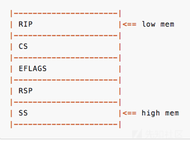
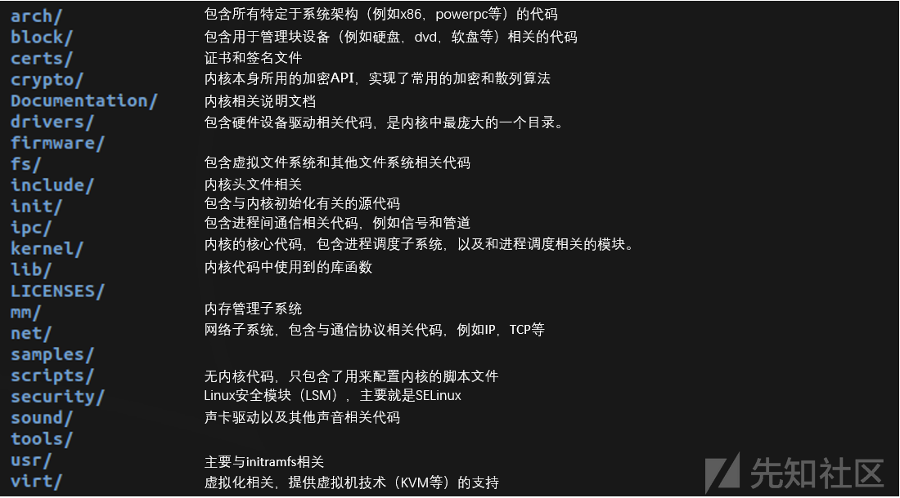

# linux kernel pwn初探

>   from：https://xz.aliyun.com/t/7625

## 基础知识

如何进图kernel态：

-   系统调用：int 0x80,syscall,ioctl
-   产生异常
-   外设产生中断
-   。。。

进入kernel前会保存各个寄存器，以及执行到代码的位置。

从kernel返回用户态需要：执行`swapgs(x64)`和`iret`指令，前提是栈上需要布置好恢复的寄存器的值。

-----

一般攻击思路：找内核漏洞，之后调用该程序进入内核态，利用漏洞进行提权，返回用户态。

返回用户态时的栈布局：



在返回用户态时，恢复完上述寄存器环境后，还需执行`swapgs`再`iretq`，其中`swapgs`用于置换`GS`寄存器和`KernelGSbase MSR`寄存器的内容（32位系统中不需要`swapgs`，直接`iret`返回即可）


## Linux Kernel源码目录结构



## CTF中kernel pwn

通常CTF比赛中`KERNEL PWN`不会直接让选手PWN掉内核，通常漏洞会存在于动态装载模块中(`LKMs`, `Loadable Kernel Modules` )，包括：

-   驱动程序(Device drivers)
-   内核扩展模块(modules)
    -   一般会给出四种文件：baby.ko , baImage, initramgs.cpio, startvm.sh
    -   bzImage是打包的内核，用于启动虚拟机与寻找gadget
    -   Initramfs.cpio：文件系统
    -   有时还会有`vmlinux`文件，这是未打包的内核，一般含有符号信息，可以用于加载到`gdb`中方便调试（`gdb vmlinux`），当寻找`gadget`时，使用`objdump -d vmlinux > gadget`然后直接用编辑器搜索会比`ROPgadget`或`ropper`快很多。
    -   没有`vmlinux`的情况下，可以使用`linux`源码目录下的`scripts/extract-vmlinux`来解压`bzImage`得到`vmlinux`（`extract-vmlinux bzImage > vmlinux`），当然此时的`vmlinux`是不包含调试信息的。
    -   还有可能附件包中没有驱动程序`*.ko`，此时可能需要我们自己到文件系统中把它提取出来

## linux kernel漏洞类型

其中主要有以下几种保护机制：

-   `KPTI`：Kernel PageTable Isolation，内核页表隔离
-   `KASLR`：Kernel Address space layout randomization，内核地址空间布局随机化
-   `SMEP`：Supervisor Mode Execution Prevention，管理模式执行保护
-   `SMAP`：Supervisor Mode Access Prevention，管理模式访问保护
-   `Stack Protector`：Stack Protector又名canary，stack cookie
-   `kptr_restrict`：允许查看内核函数地址
-   `dmesg_restrict`：允许查看`printk`函数输出，用`dmesg`命令来查看
-   `MMAP_MIN_ADDR`：不允许申请`NULL`地址 `mmap(0,....)`


> 可以通过`cat /proc/cpuinfo`来查看开启了哪些保护
>
> `KASLR`、`SMEP`、`SMAP`可通过修改`startvm.sh`来关闭
>
> `dmesg_restrict`、`dmesg_restrict`可在`rcS`文件中修改

一般来说，不管是什么漏洞，大多数利用都需要一些固定的信息，比如**驱动加载基址、`prepare_kernel_cred`地址、`commit_creds`地址**（`KASLR`开启时通过偏移计算，内核基址为`0xffffffff81000000`），因此我们需要以`root`权限启动虚拟机，可以在`startvm.sh`中把保护全部关掉。

启动的用户权限，找到`setsid`这一行，修改权限为`0000`，这里设备名称为hello2

```sh
/ # lsmod
hello2 16384 0 - Live 0xffffffffc0398000 (OE)
```

`cat /proc/kallsyms | grep "prepare_kernel_cred"`得到`prepare_kernel_cred`函数地址

```sh
/ # cat /proc/kallsyms | grep "prepare_kernel_cred"
ffffffffb10be070 T prepare_kernel_cred
ffffffffb2429228 r __ksymtab_prepare_kernel_cred
ffffffffb244092c r __kstrtab_prepare_kernel_cred
```

`cat /proc/kallsyms | grep "commit_creds"`得到`commit_creds`函数地址

```sh
/ # cat /proc/kallsyms | grep "commit_creds"
ffffffffb10bdcf0 T commit_creds
ffffffffb2421464 r __ksymtab_commit_creds
ffffffffb2440973 r __kstrtab_commit_creds
```

当我们写好`exp.c`时，需要编译并把它传到本地或远程的`QEMU`虚拟机中，但是由于出题人会使用`busybox`等精简版的系统，所以我们也不能用常规方法。这里给出一个脚本，也可以用于本地调试，就不需要重复挂载、打包等操作了。需要安装`muslgcc`（`apt install musl-tools`）

```python
from pwn import *
#context.update(log_level='debug')

HOST = "10.112.100.47"
PORT =  1717

USER = "pwn"
PW = "pwn"

def compile():
    log.info("Compile")
    os.system("musl-gcc -w -s -static -o3 oob.c -o exp")

def exec_cmd(cmd):
    r.sendline(cmd)
    r.recvuntil("$ ")

def upload():
    p = log.progress("Upload")

    with open("exp", "rb") as f:
        data = f.read()

    encoded = base64.b64encode(data)

    r.recvuntil("$ ")

    for i in range(0, len(encoded), 300):
        p.status("%d / %d" % (i, len(encoded)))
        exec_cmd("echo \"%s\" >> benc" % (encoded[i:i+300]))

    exec_cmd("cat benc | base64 -d > bout")
    exec_cmd("chmod +x bout")

    p.success()

def exploit(r):
    compile()
    upload()

    r.interactive()

    return

if __name__ == "__main__":
    if len(sys.argv) > 1:
        session = ssh(USER, HOST, PORT, PW)
        r = session.run("/bin/sh")
        exploit(r)
    else:
        r = process("./startvm.sh")
        print util.proc.pidof(r)
        pause()
        exploit(r)
```

